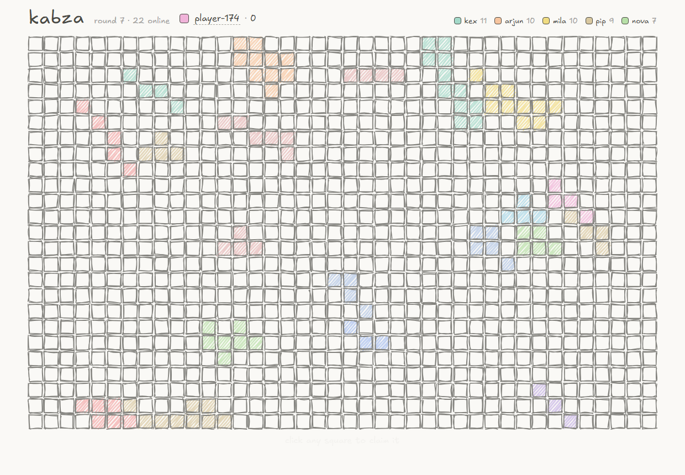

# kabza

A shared 40×25 grid of 1,000 hand-drawn cells. Open the page, click a square,
it's yours — and everyone else sees it within ~100ms. When the board fills up
the round ends, a winner is crowned, and a fresh board appears.



No signup, no landing page: the live board is the landing page. You get a
color and a placeholder name on arrival and can rename yourself inline after
you've already started playing.

## running it

Node 20+.

```sh
npm install
npm run dev        # server :8090 + vite :5173, open http://localhost:5173
```

Production is a single process serving the built client and the websocket:

```sh
npm run build
npm start          # everything on :8090
```

Other commands:

```sh
npm test           # server unit tests (vitest)
npm run hammer     # load test: 40 users spam over the rate limit, then
                   # verifies acks == snapshot == memory == sqlite
```

Config is plain env vars: `PORT` (8090), `DB_PATH` (./data/kabza.db),
`ADMIN_TOKEN` (defaults to "dev-token" with a warning). VPS setup with
nginx + systemd lives in [deploy/](deploy/DEPLOY.md).

## protocol

Raw WebSocket with JSON messages, one socket per tab. I went with raw `ws`
instead of socket.io because the protocol is small enough to own, and owning
it is most of the fun of this project. Shared types live in
[shared/src/protocol.ts](shared/src/protocol.ts).

Client → server:

| message | fields | meaning |
|---|---|---|
| `hello` | `userId`, `name?`, `sinceVersion?`, `round?` | join or rejoin; carries resync info so one message covers both |
| `claim` | `cellId`, `clientSeq` | try to take a cell |
| `resync` | `sinceVersion`, `round` | live-socket gap repair when a delta batch went missing |
| `setName` | `name` | inline rename (trimmed, control chars stripped, 24 chars max) |

Server → client:

| message | fields | meaning |
|---|---|---|
| `snapshot` | `round`, `phase`, `freezeEndsAt`, `globalVersion`, `cells`, `users`, `you` | full board state on join or when a replay would be too big |
| `deltas` | `round`, `deltas[]` | accepted claims, batched every 50ms into one frame |
| `ack` | `clientSeq`, `cellId`, `version` | your claim landed |
| `nack` | `clientSeq`, `cellId`, `reason`, `retryAfterMs?` | your claim didn't: `taken`, `cooldown`, `frozen` or `invalid` |
| `presence` | `online`, `round`, `leaderboard` | every 5s, plus once immediately on join |
| `userUpdate` | `id`, `name` | someone renamed |
| `roundOver` | `round`, `winner`, `standings`, `freezeMs` | board is full, frozen for 10s |
| `roundStart` | `round`, `globalVersion` | fresh board |

Identity is a UUID in localStorage — no auth, by design. Two tabs in the same
browser are the same player twice; both get deltas and their claims serialize
like anyone else's.

## concurrency

The server is the single authority and Node's single-threaded event loop is
the lock. Two users clicking the same cell "at once" arrive as two ordered
messages; the first mutates the cell, the second sees `owner !== null` and
gets `nack("taken")`. There is no mutex because there is nothing to guard —
the claim handler runs to completion (including the synchronous sqlite
append) before the next message is processed. Knowing *why* no lock is needed
is the design here, not an accident.

Every accepted claim gets a monotonically increasing `version`. Clients apply
a delta only if `delta.version > cell.version`, which makes application
idempotent — acks, broadcast deltas and replays can arrive in any mix and
order without corrupting the board.

Retries are safe without any server-side bookkeeping because claiming a cell
you already own just re-acks with the existing version (no new log entry, no
broadcast). After a reconnect the client re-sends whatever was in flight,
once, with the original `clientSeq`.

## feels instant

Clicks paint immediately in your color (slightly translucent) before the
server answers — that's the whole trick. The ack confirms it, a nack rolls it
back with a shake. The ack carries the cell's `version` (a small deviation
from the minimal protocol) so the optimistic paint can be promoted in place;
without it the cell would flash back to unclaimed for up to 50ms until the
batched delta arrived.

## persistence and recovery

State lives in memory; durability is an append-only claim log in sqlite
(better-sqlite3, WAL). The write happens synchronously inside the claim
handler, so the log can never be behind what clients were told. On boot the
server replays the current round's claims (≤1000 rows, instant) to rebuild
the board, the per-user counts and the resync history.

Reconnects send `hello {sinceVersion, round}`. Same round and a gap ≤250 →
one `deltas` frame replaying what was missed; anything else (new client,
round boundary, big gap, or a client somehow *ahead* of the server, which
means the db was wiped) → full snapshot, which wholesale-replaces client
state. The client also watches the live stream for version gaps and resyncs
itself if a batch ever goes missing.

`journal_mode=WAL` with `synchronous=NORMAL` means a power cut could lose the
last few claims. An app crash loses nothing. That trade felt right for a
game; flip to `FULL` if you disagree.

## rounds, not resets

A public reset button on a shared board is a griefing feature, so there isn't
one. When cell 1000 is claimed the server flushes the final delta, broadcasts
`roundOver` with the standings, freezes the board for 10s (claims nack with
`frozen`), then broadcasts `roundStart` and everyone's board clears. Rounds
and versions only ever go up; old rounds stay in the log.

For demos and accidents there's a private `POST /admin/reset` guarded by
`ADMIN_TOKEN` — it just starts the next round early.

## rate limiting

GCRA per user: 1 claim/sec sustained with a burst of 3, ~25 lines, in
memory. Over the limit you get `nack("cooldown", retryAfterMs)` and the UI
shows a draining ring on your color chip. I've shipped the same algorithm in
a webhook delivery pipeline before — it's my favorite "tiny but correct"
limiter. Denials don't consume budget, so spamming while limited doesn't dig
the hole deeper.

The hammer script is the proof: 40 virtual users at 4 claims/sec each
(4× over the limit) until ~800 cells land. On my machine: ack p50 ~1ms,
claim-to-other-clients-see-it p50 ~61ms / p95 ~64ms, and at the end the four
counts — acks received, snapshot cells, in-memory count, sqlite rows — all
agree exactly.

## the look

Cells are rough.js rectangles on one big SVG — 1.5px sketchy ink strokes,
hachure fills in the owner's color, Excalifont for the text (OFL, bundled in
[client/public/fonts/](client/public/fonts/)). Every cell's paths are
generated once with a fixed per-cell seed and cached, so redraws never
jitter and a delta only touches its own `<g>` (cells are memoized React
components; the board is one delegated click handler, not 1000).

Colors come from a curated 12-pastel palette, picked by hashing the userId —
never random RGB.

## trade-offs I chose

- **tsx in prod, no build step for the server.** One less emit pipeline in a
  monorepo; the server is I/O-bound, not CPU-bound. I'd add a `tsc` build if
  this grew.
- **better-sqlite3 pinned to v11** — v12+ ships no prebuilt binary for Node
  20 on Windows, and a native toolchain requirement is a bad first-run
  experience for a take-home.
- **No snapshot table.** Replaying one round is ≤1000 rows; a snapshot table
  is machinery without a payoff at this size.
- **Verbose snapshot wire format** (~50KB for a full board). Fine at this
  scale; packing owners into an index table is listed below, unbuilt.

## scaling past one box (design note, deliberately not built)

The current design leans on one process for ordering. To go horizontal:
move cell ownership to Redis (`SET cell:{id} {user} NX` — or a Lua script to
claim and log atomically), take versions from a Redis `INCR`, fan deltas out
over pub/sub, and keep the WS servers stateless so any client can hit any
node. For 100k cells / 10k users you'd add viewport interest management
(only send deltas for the region a client can see), binary delta encoding,
and region sharding. None of that pays for itself at 1,000 cells, which is
why it's a paragraph and not code.

## future work

Auth, teams/area-control rules, chat, mobile-perfect layout, canvas
rendering with zoom/pan, spectator/replay mode (the claim log already holds
everything a replay needs), pruning old rounds from the log.
